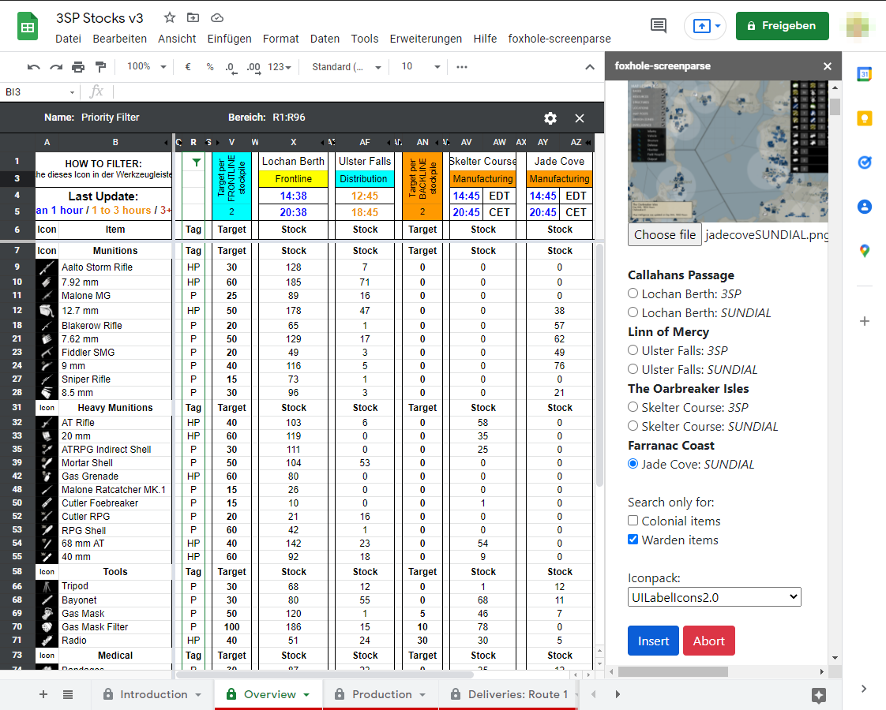
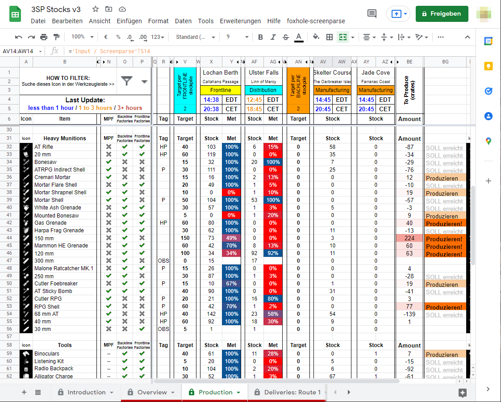
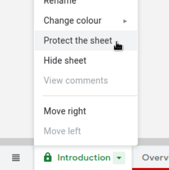
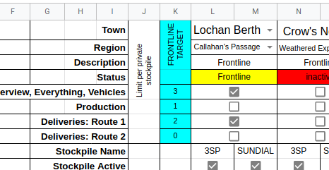
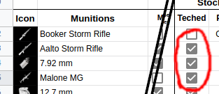

# foxhole-screenparse

Foxhole-screenparse reads contents of stockpile screenshots to ease logistics planning. 
To calculate valuable information from the stockpile data, foxhole-screeparse is integrated into the [Stocks v6.4 demo](https://docs.google.com/spreadsheets/d/1e-i3HwPQmW3dCsUXWX1G4hE4G2YQDlE-RbI4FbSx4CY/edit?usp=sharing) Google Spreadsheet ([copy sheet](https://docs.google.com/spreadsheets/d/1e-i3HwPQmW3dCsUXWX1G4hE4G2YQDlE-RbI4FbSx4CY/copy)). 
Note that the screenparser sidebar only works when logged in. 

More screenshots

  
  

Foxhole-screenparse is also available as a [standalone website](https://pogobanane.de/foxhole-screenparse/) with a simple table output.

# Spreadsheet Admin Checklist

Here you find a checklist for what to do when setting up the spreadsheet for your clan at the start of a war.

### 1. Copy the template

Item tech as of start of war: [Stocks v6 template](https://docs.google.com/spreadsheets/d/1bHlXyZUi91vty7nS8s3H2ImEQrLPwOqvUmcdqQ5bawc/copy)

### 2. Access policies

We suggest to set the following gloabl and per-sheet/tab settings:

Spreadsheet global: everyone who has the document link can edit (everyone in your clan can update the stockpiles)

Per sheet access: 

- `Overview, ..., Everything, Vehicles` should only be writable by sheed developers (admins).
- `Input / Screenparse` by everyone (it is source for stockpile data)
- `Settings` by your clans logistics officers to enable/disable stockpiles and set targets. 

To increase security you can restrict access to the entire spreadsheet to verified google accounts only. 

We strongly recommend to create a new copy of the file for each war. This way the spreadsheet link changes regularly which protects against data leaks. 

### 3. Set up stockpiles

Set the stockpile `town` names, `region` and `description` and put checkboxes to on which tabs the stockpile should be displayed. When checking checkboxes too quickly, google scripts may time out and the automated unfolding of stockpiles in other tabs may fail. Just retry in such cases.

### 4. Final steps

- Publish the link to the spreadsheet in your clan/discord. 
- Leave a note in the spreadsheet which is being replaced about its deprication.
- Occasionally update the tech status.

# Technical Overview

Foxhole-screenparse parses contents of stockpiles into machine-readable lists.
It uses a naive image processing approach using openCVs template matching and tesseract for OCR/text recognition. 
Both of those libraries run directly in your browser using wasm and thelike. 

|                                | screenparse           | [Stockpiler](https://github.com/tehruttiger/Stockpiler)   |
|--------------------------------|-----------------------|----------------------|
| platform                       | browser based         | windows app          |
| Seaports/Storage Depots        | yes                   | yes                  |
| Bunker Bases etc.              | partially             | yes                  |
| Supports different resolutions | 1080p - 4k            | manual work required |
| Supports modded item icons     | some                  | manual work required |
| imaging tech                   | openCV, tesseract OCR | openCV               |
| language                       | js                    | py                   |

# Build / Deploy

This repo contains two sub-projects: A standalone statically served website (`./index.html`) and a google spreadsheets sidebar (`./apps-script/`).

## Standalone Website

Clone this repository with all submodules: `git clone --recurse-submodules [repourl]`

Pull to fetch updates: `git pull && git submodule update`

Run a debugging server: `make debug`

The webpage has no backend, so just shove the files into some webroot or so which has its files statically served (i.e. `make install`).

## Google Spreadsheet Sidebar

Use `make appsscript` to package the files (`./apps-script/build`). Those files will be pushed to google via googles `clasp`. You can just as well copy and paste the build files to the `Apps Script` area of your spreadsheet to incorporate the sidebar, for example if you don't have clasp installed.

# Conribute

This project can use some work on the front-end. The frontend could be set up with proper compilation steps (react).

While the output table is built to be exported into spreadsheets, the relevant spreadsheet functionality could directly be built into the website.

